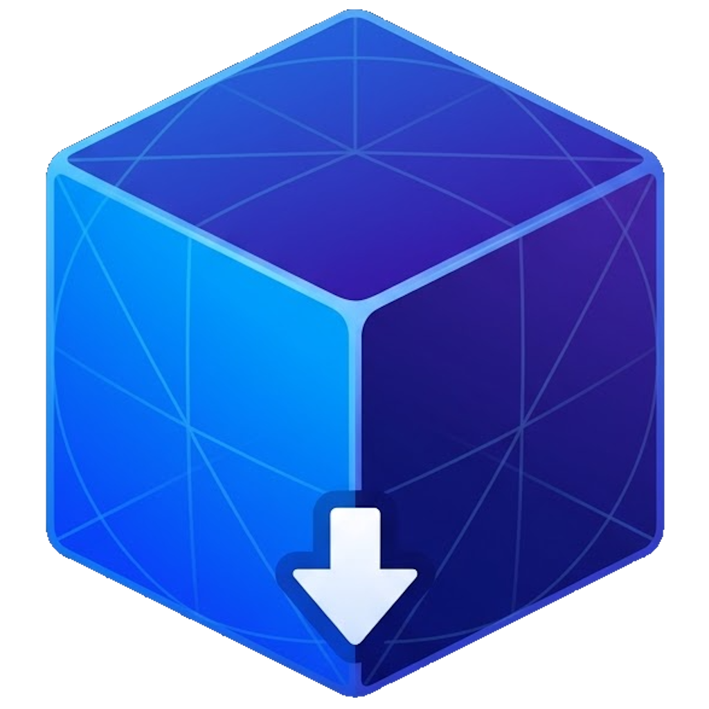

<p align="center">
  
</p>

<h1 align="center">Meshy GLB Exporter</h1>

<p align="center">Export your Meshy 3D models to GLB, straight from the viewer.</p>

<p align="center">
  <a href="https://discord.gg/VYYS9kEcjT"></a>
</p>

## What it does

It adds a blue **GLB** button to the Meshy model viewer. Open one of your models, click the button, and the model's geometry downloads as a `.glb`.

The extension reads the model out of the viewer's 3D scene in your browser, so nothing gets uploaded anywhere. It exports geometry only for now — mesh shape, no textures. It's meant for exporting your own models for personal use.

## Install on Windows (easiest)

Double-click `install.bat`. It checks for Node.js (and prints the version it finds), builds the extension, opens Chrome's extensions page and the project folder, and copies the `dist` folder path to your clipboard. Then, in Chrome: turn on **Developer mode** (top right), click **Load unpacked**, and pick the `dist` folder.

If Node.js isn't installed, the script stops and opens the download page — install Node 18+, then run `install.bat` again.

## Install by hand (any OS)

Build it once:

```bash
npm install
npm run build
```

That creates a `dist/` folder. Load it in Chrome:

1. Open `chrome://extensions`.
2. Turn on **Developer mode** (top right).
3. Click **Load unpacked** and choose the `dist` folder.

Changed or rebuilt something? Click the reload icon on the extension's card in `chrome://extensions`.

## Using it

1. Open a model on [meshy.ai/workspace](https://www.meshy.ai/workspace) so it's showing in the 3D viewer.
2. Click the blue **GLB** button in the toolbar at the bottom of the viewer.
3. Pick an option:
   - **With textures** — embeds the base color, normal, and metallic/roughness maps as a PBR material. Larger file, takes a few seconds.
   - **Geometry only** — just the mesh shape. Fast and small.
4. The `.glb` downloads.

The button only appears while a model is open, since that's the only time there's a model to export.

## Viewing the file

Drop the `.glb` into a browser viewer:

- [Model Map](https://imluri.github.io/model-map) — loads `.glb`/`.gltf`, orbit and zoom, and lets you place labelled pins on parts and export them as JSON.
- [glTF Viewer](https://gltf-viewer.donmccurdy.com) — quick check that the file opens.

## Converting to OBJ, FBX, STL, USDZ

A `.glb` imports almost everywhere. In Blender: *File → Import → glTF 2.0*, then *File → Export* to whatever you need. `assimp` and `gltf-transform` work from the command line.

## Limitations

- Textures export only for models the viewer shows textured (a `MeshStandardMaterial` with maps). A model in the plain white clay/matcap preview, or one without UVs, exports geometry only.
- Works on your own Meshy models, for personal use.
- It reads the model from the viewer in your browser; nothing leaves your machine.

## Community

Questions, ideas, or bugs — join the Discord: <https://discord.gg/VYYS9kEcjT>.

## Development

```bash
npm install    # build and test tools
npm run build  # bundle the extension into dist/
npm test       # run unit tests (Vitest)
npm run icons  # regenerate icons from logo.png
```

- Geometry capture and scene discovery: [`src/main/capture.js`](src/main/capture.js)
- GLB writer: [`src/main/glb.js`](src/main/glb.js)
- Page bridge (MAIN world): [`src/main/index.js`](src/main/index.js)
- Toolbar button: [`src/ui/index.js`](src/ui/index.js)
- Design and investigation notes: [`docs/`](docs/)
